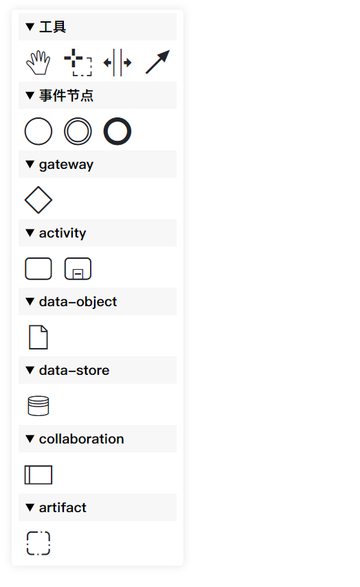
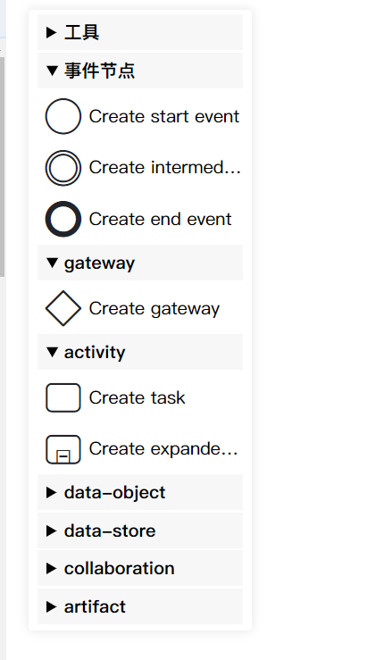

# diagram-js-accordion-palette

A palette that supports folding and unfolding, provided for diagram-js use。Base on diagram-js/palette

一个支持折叠展开的调色板，提供给 diagram-js 使用。基于 diagram-js 本身的 Palette。

## How to use 如何使用

>  This project has been published as an NPM dependency package.
>
> 该项目已经发布为一个NPM依赖包

1. Add the diagram-js-accordion-palette to your project:

```sh
npm install diagram-js-accordion-palette
```

2. Add it to the additionalModules Array


```js
import Modeler from 'bpmn-js/lib/Modeler'
import AccordionPaletteModule from 'diagram-js-accordion-palette'

// 注意，必须要引入 css 文件
import 'diagram-js-accordion-palette/assets/index.css'

const modeler = new Modeler({
  container: '#container',
  additionalModules: [
    // ...
    AccordionPaletteModule
  ],
  accordionPalette: {
    showName: true,
    accordion: true
  }
})
```

## Configurations 配置项

This plugin module supports two custom configurations.

| name             | desc      | type     | default   | required |
|------------------|-----------|----------|-----------|----------|
| showName | 是否显示名称    | boolean  | false     | false    |
| accordion      | 是否开启手风琴模式 | boolean  | false     | false    |
| defaultOpenGroups      | 默认展开的分组   | string[] | undefined | false    |

❗ 注意，`accordion` 与 `defaultOpenGroups` 互斥，且 `accordion` 优先。在需要默认展开时，请关闭手风琴模式

## Methods 方法

1. `toggle()`: Change visible / 切换显示状态
2. `open()`：Open palette / 打开 palette
3. `close()`：Close palette / 关闭 palette
4. `isOpen()`：Get palette's visible / 获取 palette 显示隐藏状态
5. `isActiveTool(toolName)`：Get a tool's active status / 获取某个指定工具的激活状态
6. `toggleState({ showName?: boolean, accordion?: boolean, defaultOpenGroups?: string[] })`：Toggle the display style of palette elements / 更改 palette 每个元素的显示状态，名称显示或者手风琴模式


## Preview 效果预览

#### 1. default 默认效果



#### 2. custom config 自定义配置 


